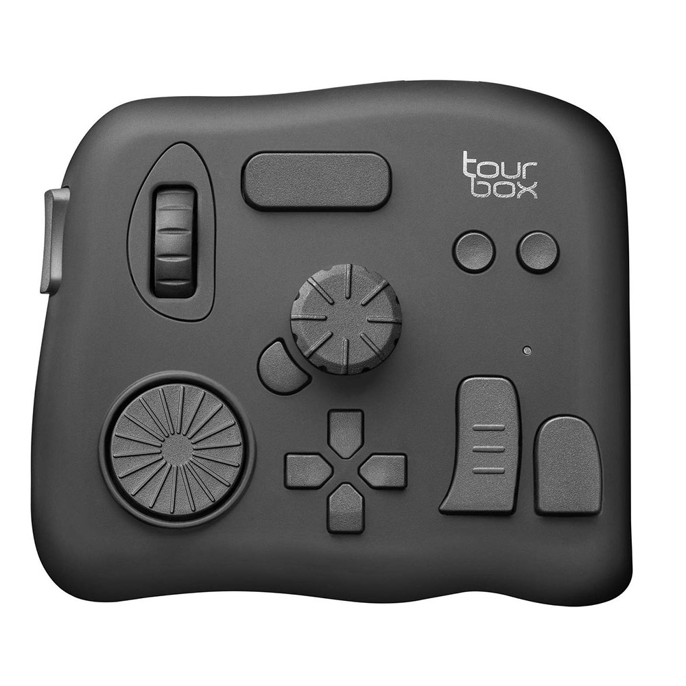

# Tourbox Neo Linux 驱动

<div align="center">
  
</div>

这是一个支持 Hyprland 窗口感知的 Tourbox Neo 驱动程序，可以根据当前活动窗口自动切换按键映射。通过 JSON 配置文件，您可以为不同的应用程序（如 GIMP、Blender 等）定制不同的按键映射。

## 功能特点

- 支持 Hyprland 窗口管理器，自动识别当前活动窗口
- 基于 JSON 的动态配置系统，易于自定义
- 支持按窗口类名和标题匹配规则
- 支持键盘按键、鼠标移动和点击等多种输入模拟

## 快速开始

### 安装依赖

```bash
# Arch Linux / Manjaro
sudo pacman -S cmake gcc nlohmann-json
```

### 构建和运行

```bash
# 克隆仓库
git clone https://github.com/yourusername/Tourbox_Neo_Linux_Driver.git
cd Tourbox_Neo_Linux_Driver

# 构建
mkdir -p build && cd build
cmake .. && make

# 运行
sudo ./tourbox_driver /dev/ttyUSB0  # 替换为您的设备路径
```

## 文档

更详细的文档请查看 [docs/README.md](docs/README.md)，包括：

- 完整的安装指南
- 配置文件格式说明
- 按键对照表
- 权限设置
- 故障排除

## 运行

```bash
# 如果已安装
sudo tourbox_driver /dev/ttyUSB0  # 替换为您的设备路径

# 如果未安装，从构建目录运行
cd build
sudo ./tourbox_driver /dev/ttyUSB0  # 替换为您的设备路径
```

### 权限设置

为了避免每次都使用 sudo，您可以将用户添加到适当的组：

```bash
# 添加用户到 input 组（用于访问 uinput）
sudo usermod -a -G input $USER

# 添加用户到 dialout 组（用于访问串口设备）
sudo usermod -a -G dialout $USER

# 创建 udev 规则（可选，但推荐）
sudo tee /etc/udev/rules.d/99-tourbox.rules > /dev/null << 'EOF'
SUBSYSTEM=="usb", ATTRS{idVendor}=="0483", ATTRS{idProduct}=="5750", MODE="0666", GROUP="input"
KERNEL=="uinput", MODE="0660", GROUP="input", OPTIONS+="static_node=uinput"
EOF

# 重新加载 udev 规则
sudo udevadm control --reload-rules
sudo udevadm trigger
```

注意：您需要注销并重新登录，或重启系统，使组成员身份更改生效。

## 配置

首次运行时，程序会自动创建默认配置文件：`~/.config/tourbox/config.json`

您可以编辑此配置文件来自定义按键映射和窗口规则。

### 配置文件格式

```json
{
  "presets": {
    "default": {
      "81": "KEY_MUTE",
      // 更多按键映射
    },
    "gimp": {
      "81": "KEY_LEFTCTRL",
      // 针对 GIMP 的映射
    }
  },
  "window_rules": [
    {"class": "Gimp", "preset": "gimp"}
  ]
}
```

- 按键代码使用十六进制格式，如 `"81"` 表示侧键按下时的代码
- 键名使用 Linux 内核定义的标准键名，如 `"KEY_MUTE"`
- 窗口规则根据窗口类名和标题匹配，并应用相应的预设

## 按键对照表

| 按键名称 | 扫描码 (十六进制) |
|---------|-----------------|
| 侧键     | 81              |
| 滚轮上   | 49              |
| 滚轮下   | 09              |
| 滚轮单击 | 8A              |
| 横键     | 82              |
| C1      | A2              |
| C2      | A3              |
| 短键     | 83              |
| 长键     | 80              |
| 上       | 90              |
| 右       | 93              |
| 下       | 91              |
| 左       | 92              |
| 转盘顺时针 | 4F             |
| 转盘逆时针 | 0F             |
| 转盘单击  | B8              |
| 旋钮顺时针 | 44             |
| 旋钮逆时针 | 04             |
| 旋钮单击  | B7              |
| Tour    | AA              |
