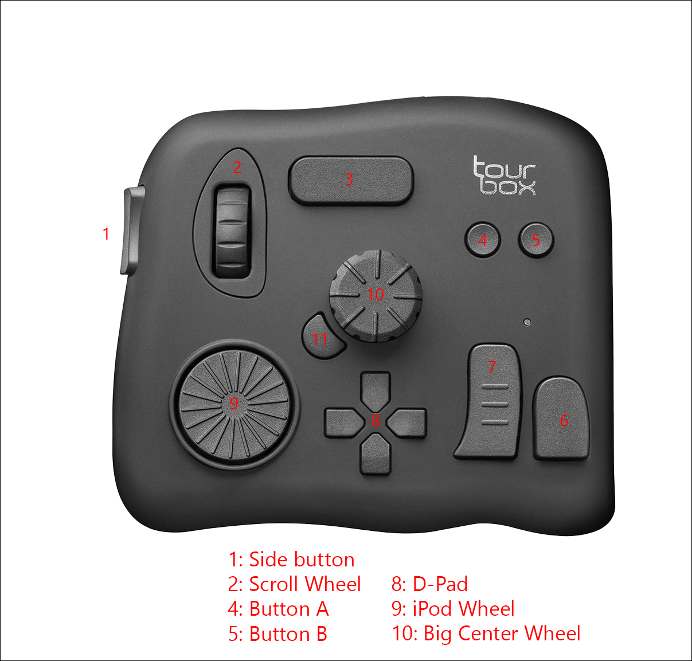

# Button Mapping

Button mapping names come from: https://github.com/torvalds/linux/blob/master/include/uapi/linux/input-event-codes.h

| Button name                       | 'Scan Code'  (Hex) | Key mapped to                 |
|-----------------------------------|--------------------|-------------------------------|
| 侧键                              | 01:81              | KEY_MUTE                      |
| 滚轮上                            | 49                 | KEY_SCROLLUP                  |
| 滚轮下                            | 09                 | KEY_SCROLLDOWN                |
| 滚轮单击                          | 0a:8a              | KEY_PAUSE                     |
| 横键                              | 02:82              | KEY_ENTER                     |
| C1                                | 22:a2              | BTN_LEFT (Mouse left click)   |
| C2                                | 23:a3              | BTN_RIGHT (Mouse right click) |
| 短键                              | 03:83              | KEY_DOT                       |
| 长键                              | 00:80              | KEY_MENU                      |
| 上                                | 10:90              | Mouse up                      |
| 右                                | 13:93              | Mouse right                   |
| 下                                | 11:91              | Mouse down                    |
| 左                                | 12:92              | Mouse left                    |
| 转盘顺时针                        | 4f                 | KEY_VOLUMEUP                  |
| 转盘逆时针                        | 0f                 | KEY_VOLUMEDOWN                |
| 转盘单击                          | 38:b8              | |
| 旋钮顺时针                        | 44                 | KEY_BRIGHTNESSUP              |
| 旋钮逆时针                        | 04                 | KEY_BRIGHTNESSDOWN            |
| 旋钮单击                          | 37:b7              | |
| Tour                              | 2a:aa              | KEY_ESC                       |




# Serial port settings

(From Picocom)

```
*** baud: 112500 (112676)
*** flow: none
*** parity: none
*** databits: 8
*** stopbits: 1
*** dtr: up
*** rts: up
*** mctl: DTR:1 DSR:0 DCD:0 RTS:1 CTS:0 RI:0
```
